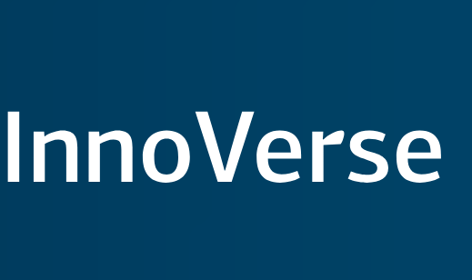

## Introduction

Welcome to InnoVerse - the innovation platform to explore and stay informed about exciting projects & initiatives in your organisation, browse the latest news and upcoming events, interact with team members, and share new updates in a collaborative and modern environment.

## Installation

If you want to get started and install InnoVerse, you can follow our [StartUp Guide]

## Contributing

If you want to take part and contribute to our project, you can read our [Contributing Guide] to learn about our development process, how to propose bugfixes and improvements, and how to build and test your changes to InnoVerse.

## Frequently Asked Questions

If you have any questions refer to the [Q&A section of our discussions forum]

## License

Innoverse is [GNU GENERAL PUBLIC] licensed.

Innoverse is a workflow engine therefore does not contain any relevant data to GDPR. If relevant data is collected, the organizations using the software have to ensure that the data is appropriately encoded or stored.

[StartUp Guide]: ./docs/developer/START_UP_GUIDE.md
[Contributing Guide]: ./CONTRIBUTING_GUIDE.md
[Q&A section of our discussions forum]: https://github.com/openkfw/innoverse/discussions/categories/q-a
[GNU GENERAL PUBLIC]: ./LICENSE.md
