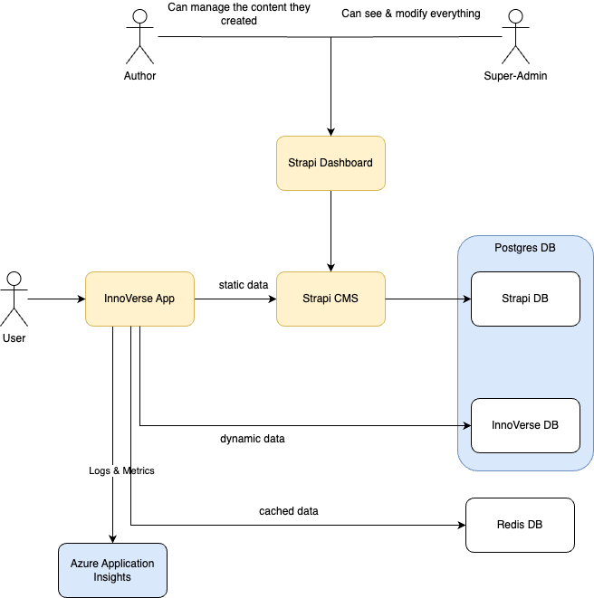

# InnoBuddy-Platform StartUp Guide

This is the StartUp Guide for the InnoBuddy Platform.
As a short introduction, the main components of the InnoBuddy Platform are shown in the diagram below:



For starting the platform, you need to start at least the Strapi CMS, the Database and the Innobuddy app.

## InnoBuddy App locally, strapi in Docker

The most common way to stat up the platform is by starting all components with docker except the InnoBuddy Next.js App.
For this you can use the `docker-compose-strapi.yaml` for strapi & DB or the `docker-compose-full.yaml` for strapi & DB

First set up the correct env vars:

- For the Azure and Gitlab Env vars (`./app/.env.example`) some examples can be found in GitLab in
  the [CICD Variable](***URL_REMOVED***) `InnoBuddyAppEnv`.
- For some of the Strapi env vars (`./strapi/.env.example`) some examples can be found in GitLab in
  the [CICD Variable](***URL_REMOVED***) `StrapiEnv`.

You can find a full list of the environment variables in the section 'Environment variables'.

```bash
# from project root
cp .env.example .env
cp ./app/.env.example ./app/.env # and then fill the missing env vars in /app
cp ./strapi/.env.example ./strapi/.env # and then fill the missing env vars in /strapi
```

Make sure you have three (3) .env files in total. One (1) in project root, one (1) in the /app folder and one (1) in the
/strapi folder.

Then start the components:

```bash
docker-compose -f docker-compose-strapi.yaml up # for starting the project with strapi
```

or

```bash
docker-compose -f docker-compose-full.yaml up  # for starting the project with strapi
```

> **IMPORTANT:**
> Now you need to generate & set the Strapi API Token

Please go the strapi admin dashboard [http://localhost:1337/admin](http://localhost:1337/admin) and create an admin
user. Remember the login information, you might need it again to access the Strapi UI.

Next, after login, go to the [API Tokens settings Page](http://localhost:1337/admin/settings/api-tokens) and generate a
new API Token (Token duration - Unlimited, Token type - Full Access) - then copy and save the token, and paste the token
in the `./app/.env` file under STRAPI_TOKEN

```bash
cd app
npm run dev
```

now your app should be visible under [http://localhost:3000](http://localhost:3000)

> **Important:**
> The CMS is not filled with data by default. You can create your own data or opt for importing data from an existing
> strapi instance - check the docs in [./strapi/README.md](./strapi/README.md##Export&Import)

#### Database: Accessing/Viewing the DB (Prisma Studio)

- First, migrate the database to prisma by running: `npm run prisma migrate dev`.

- Run `npm run prisma studio` to run the database browser and check the database.

### Push Notifications

#### Platform Setup

- Generate following ENV variables `NEXT_PUBLIC_VAPID_PUBLIC_KEY` and `VAPID_PRIVATE_KEY`
  via `npx web-push generate-vapid-keys`
- Add the contact email to the `VAPID_ADMIN_EMAIL` environment variable in format "mailto:your_email"
- Set the `STRAPI_PUSH_NOTIFICATION_SECRET` environment variable to a secret string

#### CMS Setup

- Go to the CMS > Settings > Webhooks > Create a new Webhook
- Add a meaningful name
- Add the URL of the push notifications
  - For local development: `http://host.docker.internal:3000/api/hooks/push`
  - For production: `https://${YOUR-DOMAIN}/api/hooks/push`
- Add the header `Authorization`, the value should be the value of the environment
  variable `STRAPI_PUSH_NOTIFICATION_SECRET`
- Add all the events to the webhook

> **Important:**
> For local development, the `http://host.docker.internal:3000/api/hooks/push` URL is used to access the platform!
> This means your docker-compose file should use `network_mode: host` for strapi and db services. (This might also
> include some changes in your `.env` file configuration i.e. the database/strapi host has to be set to `127.0.0.1`)

### Azure Application Insights

- Configure all required components for Azure Application Insights in the Azure Portal or via IaC.
- Set the following environment variables in the `.env` file:
  - `NEXT_PUBLIC_APP_INSIGHTS_CONNECTION_STRING`: Can be found in the Azure Portal
  - `NEXT_PUBLIC_APP_INSIGHTS_INSTRUMENTATION_KEY`: Can be found in the Azure Portal
  - `APP_INSIGHTS_SERVICE_NAME`: Can be chosen freely`
- NB: The logs will only be published if the environment variable `NODE_ENV` is set to `production`!

### Analyze the build

You can analyze the bundle size running `npm run build:analyze`, this will generate a report and can help identify large chunks.
The main focus should here be the `client` report, as we do not use any edge functions.

### Environment variables

| Name                                         | Required | Default | Stage     | Component |
| -------------------------------------------- | -------- | ------- | --------- | --------- |
| POSTGRES_USER                                | Y        | -       | Runtime   | Strapi    |
| POSTGRES_PASSWORD                            | Y        | -       | Runtime   | Strapi    |
| DATABASE_URL                                 | Y        | -       | Runtime   | Innoverse |
| NEXTAUTH_URL                                 | Y        | -       | Runtime   | Innoverse |
| POSTGRES_USER                                | N        | -       | Runtime   | Innoverse |
| POSTGRES_PASSWORD                            | N        | -       | Runtime   | Innoverse |
| NEXTAUTH_AZURE_CLIENT_ID                     | N(\*)    | -       | Runtime   | Innoverse |
| NEXTAUTH_AZURE_CLIENT_SECRET                 | N(\*)    | -       | Runtime   | Innoverse |
| NEXTAUTH_AZURE_TENANT_ID                     | N(\*)    | -       | Runtime   | Innoverse |
| NEXTAUTH_SECRET                              | N(\*)    | -       | Runtime   | Innoverse |
| NEXTAUTH_GITLAB_ID                           | N(\*)    | -       | Runtime   | Innoverse |
| NEXTAUTH_GITLAB_SECRET                       | N(\*)    | -       | Runtime   | Innoverse |
| NEXTAUTH_GITLAB_URL                          | N(\*)    | -       | Runtime   | Innoverse |
| NEXTAUTH_CREDENTIALS_USERNAME                | N(\*)    | -       | Runtime   | Innoverse |
| NEXTAUTH_CREDENTIALS_PASSWORD                | N(\*)    | -       | Runtime   | Innoverse |
| NEXT_PUBLIC_STRAPI_GRAPHQL_ENDPOINT          | Y        | -       | Buildtime | Innoverse |
| NEXT_PUBLIC_STRAPI_ENDPOINT                  | Y        | -       | Buildtime | Innoverse |
| STRAPI_TOKEN                                 | Y        | -       | Runtime   | Innoverse |
| HTTP_BASIC_AUTH                              | Y        | -       | Runtime   | Innoverse |
| NEXT_PUBLIC_VAPID_PUBLIC_KEY                 | N        | -       | Buildtime | Innoverse |
| VAPID_PRIVATE_KEY                            | N        | -       | Runtime   | Innoverse |
| VAPID_ADMIN_EMAIL                            | N        | -       | Runtime   | Innoverse |
| STRAPI_PUSH_NOTIFICATION_SECRET              | N        | -       | Runtime   | Innoverse |
| NEXT_PUBLIC_APP_INSIGHTS_CONNECTION_STRING   | N        | -       | Buildtime | Innoverse |
| NEXT_PUBLIC_APP_INSIGHTS_INSTRUMENTATION_KEY | N        | -       | Buildtime | Innoverse |
| APP_INSIGHTS_SERVICE_NAME                    | N        | -       | Runtime   | Innoverse |

(\*) Note: At least one authentication method must be enabled
