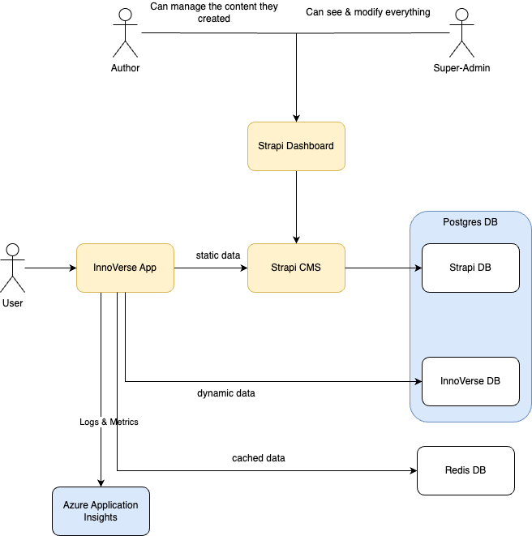

# InnoVerse Platform – System Architecture

This document outlines the architecture of the InnoVerse Platform. It provides an overview of the system components, their roles, interactions, and important configuration aspects. This is intended for developers, DevOps engineers, and technical stakeholders.

---

## Architecture Diagram

---

## 🧩 Component Overview

### 1. InnoVerse App (Frontend)

- **Type:** Next.js Application
- **Role:** Main user interface; fetches and displays content from Strapi via GraphQL and REST.
- **Dev Note:** Supports local development with `pnpm run dev`.
- **Features:**
  - Auth (NextAuth with support for Azure, GitLab, and credentials)
  - Project Data and other entities (using data from the CMS)
  - News Feed (uses Redis caching)
  - Dynamic Features (Comments, Reactions, Likes - stored in the Postgres DB)
  - Push Notifications
  - Azure Application Insights integration

---

### 2. Strapi CMS

- **Type:** Node.js-based CMS
- **Role:** Content management and API provider (REST + GraphQL)
- **API Token:** Required for frontend to access content (set in `.env`)
- **Database:** Uses a Postgres Database for storing data

---

### 3. PostgreSQL Innoverse DB

- **Role:** Application data
- **Access Tool:** Prisma + Prisma Studio
- **Dev Note:** Prisma migration required (`pnpm run prisma migrate dev`)

---

### 4. PostgreSQL Strapi DB

- **Role:** Persistent storage for Strapi
- **Access Tool:** `psql` commands

---

### 5. Redis (Cache Layer)

- **Role:** Caching for the News Feed
- **Behavior:** Can be fully refreshed via `/api/redis/full-refresh`
- **Permissions:** Controlled via Strapi’s `UserPermission` config

---

## ⚙️ Infrastructure

### Docker

- **Tool:** Docker Compose
- **Purpose:** Simplified local development of all services (App, Strapi, Redis, DB)
- **Startup Command:** `bash startDev.sh`

---

## 🔐 Authentication

Supported auth providers via NextAuth:

- Azure AD
- GitLab
- Credentials (Username/Password)

Configure through relevant `NEXTAUTH_` environment variables (check [./environment_variables.md](../environment_variables.md)).
